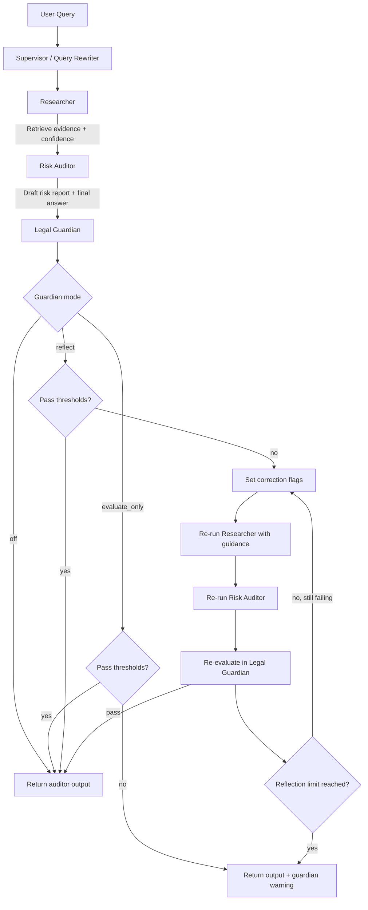
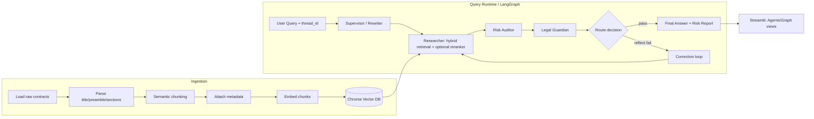
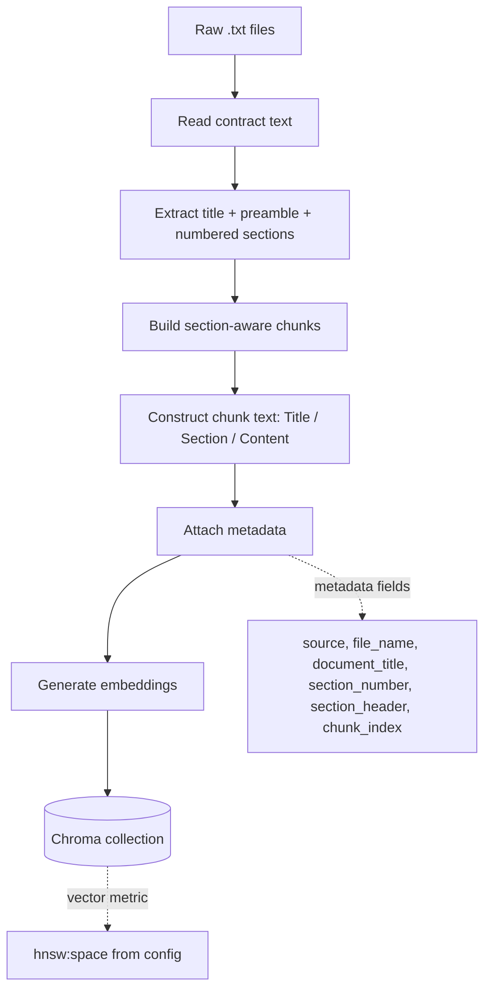
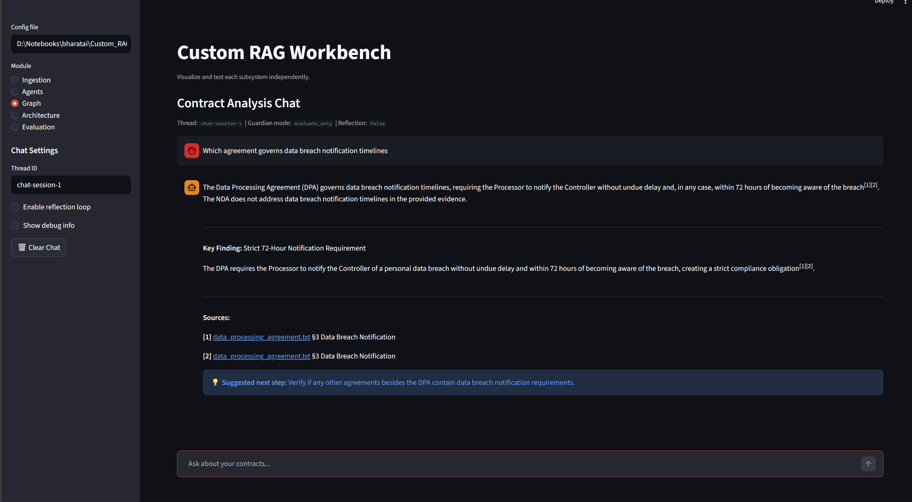
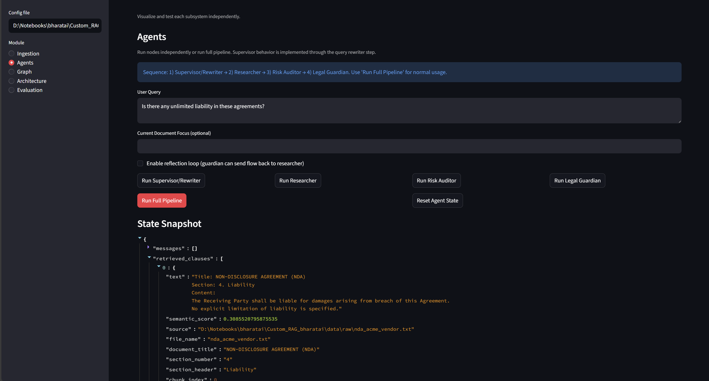
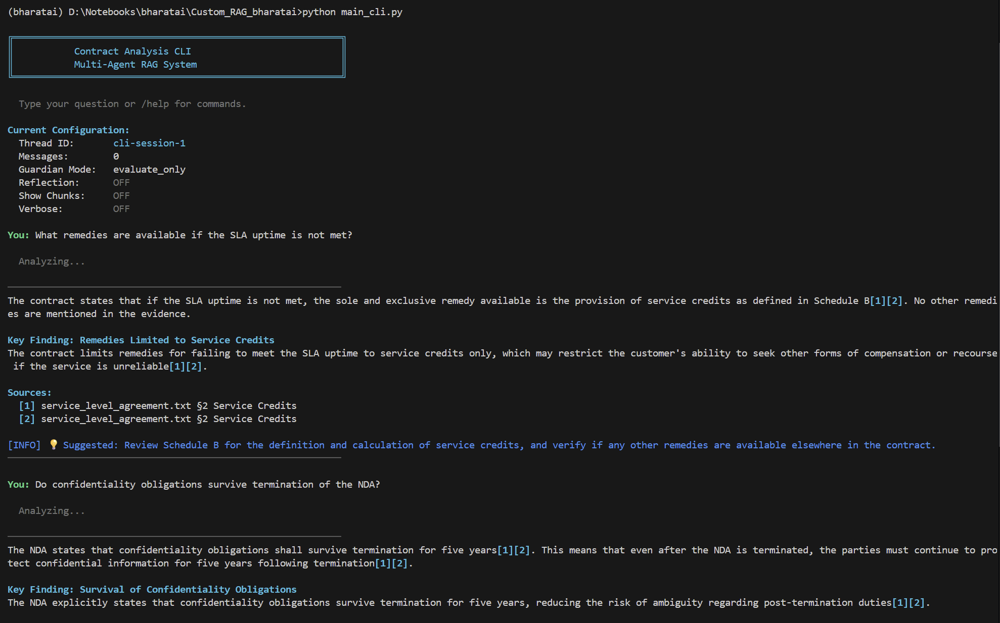
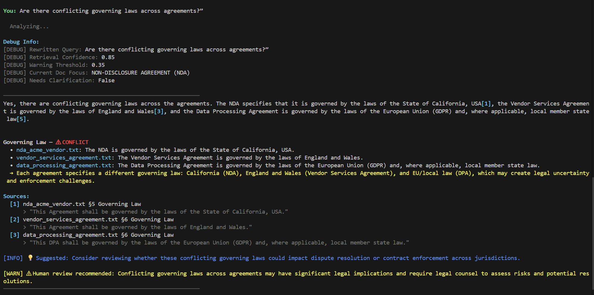

# Custom RAG Bharatai

A contract-focused Multi-Agent RAG system for legal document ingestion, retrieval, and risk-oriented analysis.

## Table of Contents

- [1) Process Overview](#1-process-overview)
- [2) Agents and Responsibilities](#2-agents-and-responsibilities)
- [3) Agent Flow Chart](#3-agent-flow-chart)
- [4) Whole RAG Flow Chart](#4-whole-rag-flow-chart)
- [5) Ingestion Flow and Key Considerations](#5-ingestion-flow-and-key-considerations)
- [6) Streamlit App Capabilities](#6-streamlit-app-capabilities)
- [7) Screenshots (Streamlit + CLI)](#7-screenshots-streamlit--cli)
- [8) How the End-to-End Process Works](#8-how-the-end-to-end-process-works)
- [9) Getting Started](#9-getting-started)
- [10) Configuration Summary](#10-configuration-summary)
- [11) Troubleshooting](#11-troubleshooting)
- [12) Example Questions](#12-example-questions)
- [13) Suggested Run Sequence](#13-suggested-run-sequence)
- [14) Future Improvements](#14-future-improvements)

## 1) Process Overview

The project is designed around two major pipelines:

- **Ingestion pipeline**: parse raw contracts, preserve legal structure, chunk semantically, embed, and persist into Chroma.
- **Query pipeline (Agent/Graph)**: rewrite ambiguous follow-up queries, retrieve relevant clauses, generate a risk-oriented answer, and validate output quality through a Legal Guardian node.

### Key Design Principles

- Preserve legal structure (`document_title`, `section_number`, `section_header`) during ingestion.
- Keep retrieval and auditing separate for transparency.
- Support multi-turn context with LangGraph checkpointing (`thread_id`).
- Provide interactive inspection through Streamlit.

---

## 2) Agents and Responsibilities

### Why a Multi-Agent Approach?

Contract QA systems fail in predictable ways: vague follow-up questions lose context, retrieval can silently drift to the wrong clause, and answer generation can over-generalize beyond the evidence. This project splits those responsibilities into focused agents so each step is **inspectable**, **tunable**, and **correctable**.

- **Separation of concerns**: retrieval and reasoning are intentionally split so you can see *exactly* what evidence was used.
- **Grounded answers with citations**: the Risk Auditor is constrained to the retrieved evidence only.
- **Quality gate**: the Legal Guardian scores faithfulness/relevancy and can trigger correction loops.
- **Multi-turn continuity**: the Supervisor rewrites follow-ups so conversation stays coherent.

### Supervisor / Query Rewriter

- Reads current conversation state and user query.
- Rewrites ambiguous follow-up questions into clearer standalone queries.
- Helps maintain continuity with prior `current_doc_focus`.

Why it exists:
- Users naturally ask follow-ups like “what about indemnity?”; rewriting turns those into a standalone question that retrieval can handle reliably.

### Researcher

- Retrieves top candidate chunks from Chroma using hybrid retrieval (semantic similarity + lexical/header/doc-focus signals).
- Returns structured evidence objects with metadata and scores.
- Supports optional LLM reranking over top candidates.
- Sets retrieval confidence and warning/clarification signals.

Why it exists:
- Retrieval is the highest-leverage step in RAG. The Researcher makes retrieval transparent and produces confidence signals (so the UI can warn/ask clarifying questions).

### Risk Auditor

- Consumes retrieved evidence only.
- Produces structured risk-style findings with severity and citations.
- Uses a strict critic-style system prompt.

Why it exists:
- This is the “backbone”: it forces strict grounding, clean answer-first output, and traceable citations. If a clause is missing, it should say it cannot answer rather than guess.

### Legal Guardian

- Evaluates the Risk Auditor output for faithfulness and relevancy against retrieved evidence.
- Produces guardian scores and pass/fail control flags.
- Can trigger correction loops when `guardian.mode=reflect` and thresholds are not met.

Why it exists:
- A dedicated validator reduces hallucinations and catches “answer drift” from the retrieved evidence, especially in multi-turn conversations.

---

## 3) Agent Flow Chart


### Mermaid Source (Agent Flow)




---

## 4) Whole RAG Flow Chart


### Mermaid Source (Whole RAG)



---

## 5) Ingestion Flow and Key Considerations

### Ingestion Steps

1. Read each raw `.txt` contract.
2. Extract:
   - document title
   - preamble (intro before numbered sections)
   - numbered sections
3. Build semantic chunks while preserving legal context in chunk text:
   - `Title: ...`
   - `Section: ...`
   - `Content: ...`
4. Attach metadata:
   - `source`, `file_name`, `document_title`, `section_number`, `section_header`, `chunk_index`
5. Embed chunks and persist into Chroma.

### Key Things Considered

- **Structure preservation** improves legal retrieval quality.
- **Section-level metadata** supports filtering and explainability.
- **Config-driven behavior** controls model, chunking, paths, and vector space from YAML.
- **Optional reset** allows full reindex when embedding model or vector settings change.

### Ingestion Flow Chart


### Mermaid Source (Ingestion)



---

## 6) Streamlit App Capabilities

The Streamlit app (`streamlit_app.py`) provides module-wise testing:

### Ingestion Panel

- Reads config and displays ingestion settings.
- Parses selected contract and shows sections.
- Previews semantic chunks and metadata.
- Runs full ingestion into Chroma.

### Agents Panel

- Step-by-step execution:
  1. Supervisor/Rewriter
  2. Researcher
   3. Risk Auditor
   4. Legal Guardian
- One-click full pipeline execution.
- Supports runtime reflection toggle and max reflection count.
- Shows full state snapshot, retrieved chunks, confidence, warnings, guardian scores, and risk report.

### Graph Panel

- Runs full LangGraph flow with `thread_id`.
- Uses checkpointed memory for multi-turn behavior.
- Includes conditional routing through Legal Guardian and optional reflection loops.
- Shows final state, retrieved chunks, guardian decisions, and risk report.

### Evaluation Panel

- Placeholder for future evaluator integration.

---

## 7) Screenshots (Streamlit + CLI)

Add screenshots to `docs/images/` using the filenames below. They will automatically render in this README.

### Streamlit



Suggested capture: one query with final answer + key finding + sources.



Suggested capture: researcher chunks + guardian/reflection metrics.

### CLI



Suggested capture: clean answer-first output with inline citations.



Suggested capture: `--chunks --reflection --verbose` output.

---

## 8) How the End-to-End Process Works

1. **Ingest contracts**
   - Raw `.txt` agreements from `data/raw/` are parsed and sectioned.
   - Semantic chunks are produced with legal metadata (`file_name`, section info).
   - Chunks are embedded and stored in Chroma (`data/chroma_db/`).

2. **Ask a question (chat turn)**
   - User question enters LangGraph with `thread_id` memory.
   - Supervisor rewrites ambiguous follow-ups into standalone queries.
   - Researcher retrieves evidence chunks (hybrid retrieval + optional reranking).
   - Risk Auditor builds a strictly grounded answer from evidence only.
   - Legal Guardian scores faithfulness/relevancy and may trigger a correction loop.

3. **Return an explainable answer**
   - Primary answer with inline citation markers (for example `[1]`, `[2]`).
   - Numbered sources linked to original agreement sections.
   - Optional debug: chunks, reflection metrics, retrieval warnings.

---

## 9) Getting Started

### What You Get

- **Streamlit UI** for ingestion + step-by-step agent inspection + multi-turn chat
- **CLI chat** for fast iteration, with optional debug flags (chunks/reflection/verbose)
- **FastAPI service** for integrating with other tools and UIs

### Installation

1) Create and activate a virtual environment

Windows (PowerShell):

```bash
python -m venv .venv
.venv\Scripts\Activate.ps1
```

macOS/Linux:

```bash
python -m venv .venv
source .venv/bin/activate
```

2) Install dependencies

```bash
pip install -r requirements.txt
```

3) Configure providers + keys

Primary config: `src/resources/config-local.yaml`

- `llm.api_key_env` and `embeddings.api_key_env` accept either:
   - an environment variable name (preferred), or
   - a literal key starting with `sk-`.

Environment variable approach (recommended):

```bash
setx OPENROUTER_API_KEY "<your_key>"
```

macOS/Linux:

```bash
export OPENROUTER_API_KEY="<your_key>"
```

Then set in YAML:
- `llm.api_key_env: OPENROUTER_API_KEY`
- `embeddings.api_key_env: OPENROUTER_API_KEY`

Tip: avoid committing real keys into YAML; prefer env vars.

4) Add your contracts

- Put raw `.txt` files into `data/raw/` (or update `ingestion.raw_dir`).

5) Run ingestion once

- Easiest: run Streamlit and use the **Ingestion** panel.

### Prerequisites

- Python 3.11+
- A valid API key/provider config in `src/resources/config-local.yaml`

### Quickstart (Fastest Path)

```bash
streamlit run streamlit_app.py
```

1. Ingestion → ingest documents
2. Graph → ask questions and review citations

### A) Run Streamlit App

```bash
streamlit run streamlit_app.py
```

Use the panels in this order:
1. **Ingestion** → ingest documents
2. **Agents** → inspect each node
3. **Graph** → run full multi-turn chat flow

### B) Run CLI Chat

```bash
python main_cli.py
```

Useful options:

```bash
python main_cli.py --chunks --reflection --verbose
```

In-session commands:
- `/help` → show commands
- `/chunks` → toggle retrieved chunks view
- `/reflection` → toggle guardian metrics
- `/verbose` → toggle extra debug details
- `/clear` → reset thread memory
- `/thread <id>` → switch conversation thread

### C) Run FastAPI Service

```bash
python main_api.py
```

Open API docs:
- `http://localhost:8000/docs`

Main endpoints:
- `POST /api/v1/chat/query` → run one analysis turn
- `GET /api/v1/chat/{thread_id}/history` → fetch thread history
- `DELETE /api/v1/chat/{thread_id}` → clear thread history
- `GET /health` → liveness check

Example request:

```bash
curl -X POST "http://localhost:8000/api/v1/chat/query" \
   -H "Content-Type: application/json" \
   -d "{\"query\": \"What is the liability cap and what exceptions apply?\", \"return_chunks\": false, \"return_reflection\": false}"
```

---

## 10) Configuration Summary

Primary config file: `src/resources/config-local.yaml`

Sections:

- `llm`: provider, base URL, model, generation params, optional headers.
- `embeddings`: provider, base URL, embedding model, optional headers.
- `ingestion`: raw path, persist path, collection name, vector space, chunk params, reset flag.
- `guardian`: mode (`off | evaluate_only | reflect`), thresholds, reflection limits.
- `retrieval`: hybrid retrieval weights, top-k, reranker toggle/model controls.

### Practical Tuning Guide (Most Useful Knobs)

**llm**
- `llm.model`: choose your reasoning model (higher quality = higher cost/latency).
- `llm.temperature`: keep at `0.0` for deterministic, audit-style output.
- `llm.max_tokens`: raise if answers are being cut off.

**embeddings**
- `embeddings.model`: higher-quality embeddings typically improve clause recall.

**ingestion**
- `ingestion.chunk_size` / `ingestion.chunk_overlap`: increase size if clauses are split too aggressively; increase overlap if answers miss cross-sentence context.
- `ingestion.vector_space`: keep consistent once a DB is built; changing it usually requires re-ingestion.
- `ingestion.reset_collection`: set `true` to rebuild embeddings from scratch.

**guardian**
- `guardian.mode`:
   - `off`: fastest; no scoring
   - `evaluate_only`: scores and warns, but does not loop
   - `reflect`: enables correction loops (best quality, more latency)
- `guardian.faithfulness_threshold`: raise to be stricter (more “cannot answer” / more correction attempts).
- `guardian.max_correction_attempts`: cap cost/latency.
- `guardian.focus_drift_penalty`: increase if follow-up questions drift across documents too easily.

**retrieval**
- `retrieval.semantic_candidate_k`: raise to widen initial recall.
- `retrieval.final_top_k`: how many clauses are handed to the Risk Auditor.
- `retrieval.semantic_weight` / `retrieval.keyword_weight`: tune based on whether your contracts have strong section headers/keywords.
- `retrieval.section_header_boost`: increase if matching headings matter (e.g., “Indemnification”, “Limitation of Liability”).
- `retrieval.doc_focus_boost`: increase if you want follow-ups to stay in the same agreement.
- `retrieval.low_confidence_warning_threshold`: raise to warn more aggressively when retrieval is weak.
- `retrieval.enable_llm_reranker`: keep `true` if you want better evidence ordering; disable for speed.
- `retrieval.reranker_model`: small model is usually enough; upgrade only if reranking is visibly wrong.

---

## 11) Troubleshooting

- `ModuleNotFoundError: No module named 'langchain_chroma'`
   - Install the missing dependency: `pip install langchain-chroma`
- “Missing API key. Set environment variable: …”
   - Ensure the env var exists and `llm.api_key_env` / `embeddings.api_key_env` points to it.
- Retrieval looks irrelevant / low confidence
   - Increase `retrieval.semantic_candidate_k` and/or enable the reranker.
   - Check that ingestion has been run and `ingestion.persist_dir` points to the correct Chroma DB.

---

## 12) Example Questions

- “What is the liability cap and what exceptions apply?”
- “Compare indemnification obligations across the agreements. Any conflicts?”
- “Is there a governing law conflict between the NDA and the services agreement?”
- “What payment terms create risk for Acme Corp?”

---

## 13) Suggested Run Sequence

1. Validate config and API key.
2. Run ingestion from Streamlit Ingestion panel.
3. Verify retrieved chunks in Agents panel.
4. Run Graph panel for end-to-end query testing.

---

## 14) Future Improvements

- Evaluation metrics dashboard in Streamlit.
- Per-node latency and token telemetry.
- Automatic retrieval/guardian threshold tuning from eval datasets.
- FastAPI scalability hardening: run the API with multiple workers (e.g., Uvicorn/Gunicorn workers) and progressively migrate graph execution, retrieval, and LLM calls to asynchronous paths for higher I/O concurrency.
