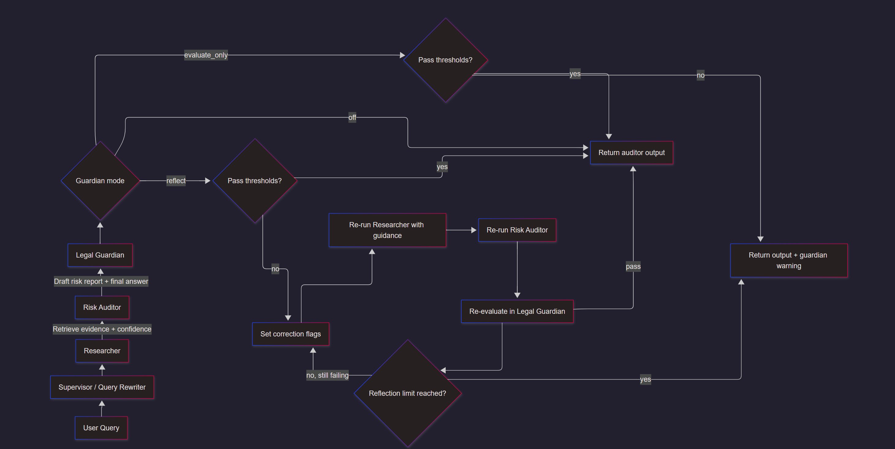
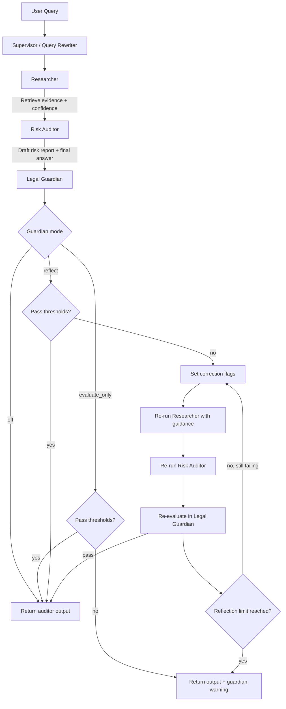
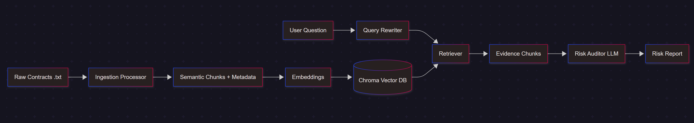
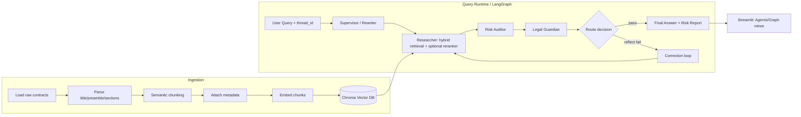
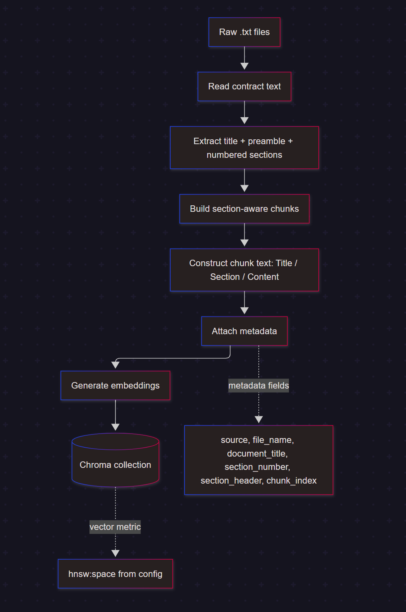
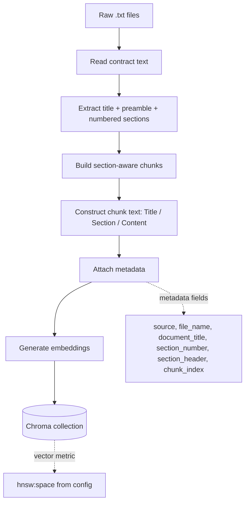

# Custom RAG Bharatai

A contract-focused Multi-Agent RAG system for legal document ingestion, retrieval, and risk-oriented analysis.

## 1) Process Overview

The project is designed around two major pipelines:

- **Ingestion pipeline**: parse raw contracts, preserve legal structure, chunk semantically, embed, and persist into Chroma.
- **Query pipeline (Agent/Graph)**: rewrite ambiguous follow-up queries, retrieve relevant clauses, generate a risk-oriented answer, and validate output quality through a Legal Guardian node.

### Key Design Principles

- Preserve legal structure (`document_title`, `section_number`, `section_header`) during ingestion.
- Keep retrieval and auditing separate for transparency.
- Support multi-turn context with LangGraph checkpointing (`thread_id`).
- Provide interactive inspection through Streamlit.

---

## 2) Agents and Responsibilities

### Supervisor / Query Rewriter

- Reads current conversation state and user query.
- Rewrites ambiguous follow-up questions into clearer standalone queries.
- Helps maintain continuity with prior `current_doc_focus`.

### Researcher

- Retrieves top candidate chunks from Chroma using hybrid retrieval (semantic similarity + lexical/header/doc-focus signals).
- Returns structured evidence objects with metadata and scores.
- Supports optional LLM reranking over top candidates.
- Sets retrieval confidence and warning/clarification signals.

### Risk Auditor

- Consumes retrieved evidence only.
- Produces structured risk-style findings with severity and citations.
- Uses a strict critic-style system prompt.

### Legal Guardian

- Evaluates the Risk Auditor output for faithfulness and relevancy against retrieved evidence.
- Produces guardian scores and pass/fail control flags.
- Can trigger correction loops when `guardian.mode=reflect` and thresholds are not met.

---

## 3) Agent Flow Chart

### Mermaid Source (Agent Flow)

---

## 4) Whole RAG Flow Chart

### Mermaid Source (Whole RAG)

---

## 5) Ingestion Flow and Key Considerations

### Ingestion Steps

1. Read each raw `.txt` contract.
2. Extract:
   - document title
   - preamble (intro before numbered sections)
   - numbered sections
3. Build semantic chunks while preserving legal context in chunk text:
   - `Title: ...`
   - `Section: ...`
   - `Content: ...`
4. Attach metadata:
   - `source`, `file_name`, `document_title`, `section_number`, `section_header`, `chunk_index`
5. Embed chunks and persist into Chroma.

### Key Things Considered

- **Structure preservation** improves legal retrieval quality.
- **Section-level metadata** supports filtering and explainability.
- **Config-driven behavior** controls model, chunking, paths, and vector space from YAML.
- **Optional reset** allows full reindex when embedding model or vector settings change.

### Ingestion Flow Chart

                                       

### Mermaid Source (Ingestion)

---

## 6) Streamlit App Capabilities

The Streamlit app (`streamlit_app.py`) provides module-wise testing:

### Ingestion Panel

- Reads config and displays ingestion settings.
- Parses selected contract and shows sections.
- Previews semantic chunks and metadata.
- Runs full ingestion into Chroma.

### Agents Panel

- Step-by-step execution:
  1. Supervisor/Rewriter
  2. Researcher
   3. Risk Auditor
   4. Legal Guardian
- One-click full pipeline execution.
- Supports runtime reflection toggle and max reflection count.
- Shows full state snapshot, retrieved chunks, confidence, warnings, guardian scores, and risk report.

### Graph Panel

- Runs full LangGraph flow with `thread_id`.
- Uses checkpointed memory for multi-turn behavior.
- Includes conditional routing through Legal Guardian and optional reflection loops.
- Shows final state, retrieved chunks, guardian decisions, and risk report.

### Evaluation Panel

- Placeholder for future evaluator integration.

---

## 7) Configuration Summary

Primary config file: `src/resources/config-local.yaml`

Sections:

- `llm`: provider, base URL, model, generation params, optional headers.
- `embeddings`: provider, base URL, embedding model, optional headers.
- `ingestion`: raw path, persist path, collection name, vector space, chunk params, reset flag.
- `guardian`: mode (`off | evaluate_only | reflect`), thresholds, reflection limits.
- `retrieval`: hybrid retrieval weights, top-k, reranker toggle/model controls.

---

## 8) Suggested Run Sequence

1. Validate config and API key.
2. Run ingestion from Streamlit Ingestion panel.
3. Verify retrieved chunks in Agents panel.
4. Run Graph panel for end-to-end query testing.

---

## 9) Future Improvements

- Evaluation metrics dashboard in Streamlit.
- Per-node latency and token telemetry.
- Automatic retrieval/guardian threshold tuning from eval datasets.
